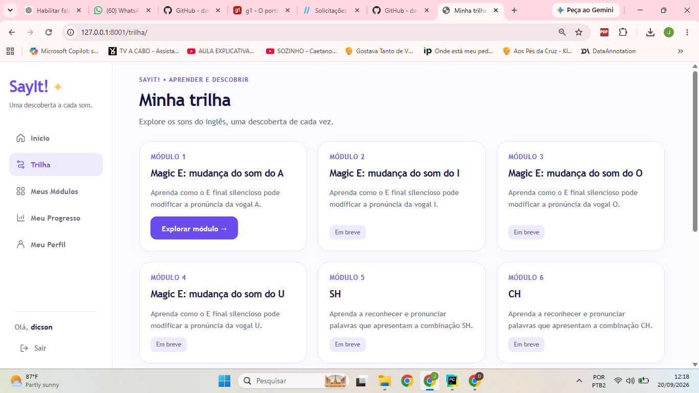
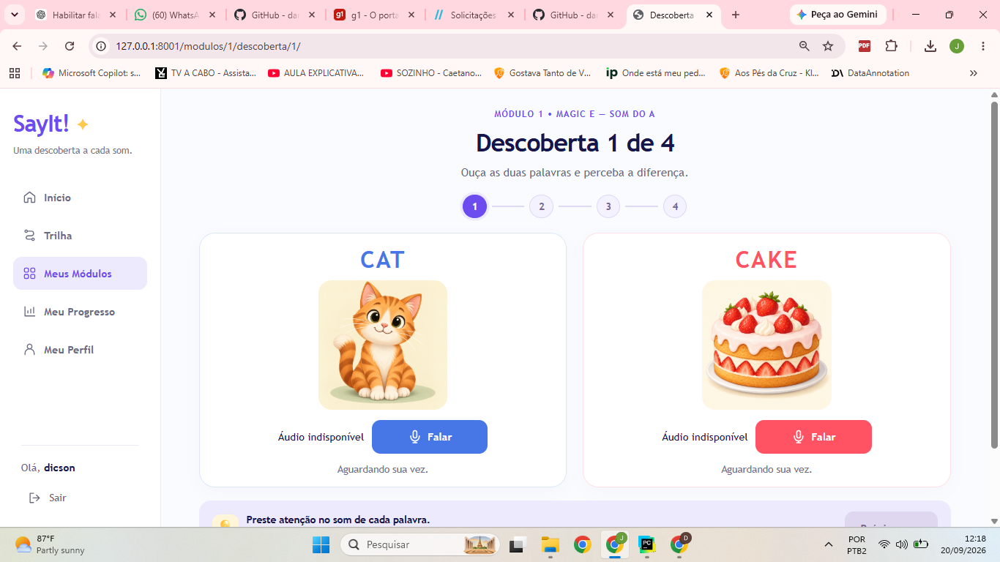

# SayIt! 🎤📚

Progressive Web App educacional para auxiliar crianças dos anos iniciais do Ensino Fundamental na aprendizagem de vocabulário e pronúncia da língua inglesa.

## Objetivo

O SayIt! combina:

- imagens
- áudio
- microfone
- reconhecimento de voz
- feedback imediato
- acompanhamento de progresso

A proposta é ajudar o aluno a relacionar palavra escrita, significado, som e pronúncia.

## Público-alvo

Crianças dos anos iniciais do Ensino Fundamental.

Projeto acadêmico desenvolvido para o curso de Sistemas de Informação.

## Cliente fictício

Instituto Martin Luther King.

Instituição fictícia criada exclusivamente para fins acadêmicos.

## Conteúdo pedagógico

A trilha possui 10 módulos:

1. Magic E: mudança do som do A
2. Magic E: mudança do som do I
3. Magic E: mudança do som do O
4. Magic E: mudança do som do U
5. SH
6. CH
7. TH
8. PH
9. OO
10. Revisão geral

---

## 🎨 Demonstração do projeto

O **SayIt!** possui uma interface educacional responsiva, desenvolvida para tornar o aprendizado de pronúncia mais visual, interativo e progressivo.

### 🗺️ Minha Trilha

A trilha de aprendizagem organiza os conteúdos em módulos de pronúncia. O primeiro módulo trabalha o **Magic E — mudança do som do A**, enquanto os módulos seguintes expandem o aprendizado para outros padrões fonéticos da língua inglesa.

### 🎤 Descobertas interativas

Nas atividades de descoberta, o aluno associa **palavra, imagem, áudio e pronúncia**.

No exemplo abaixo, **CAT** e **CAKE** demonstram como o **E final silencioso** modifica o som da vogal A. O aluno utiliza o microfone para praticar a pronúncia antes de avançar para a próxima descoberta.

---

## Tecnologias

- Python
- Django
- SQLite
- HTML5
- CSS3
- JavaScript
- Pillow
- PWA

## Estado atual

- 10 módulos cadastrados
- 71 registros de palavras
- 58 palavras distintas
- 13 comparações didáticas
- banco base populado
- comando de associação de imagens implementado

## Status

Projeto em desenvolvimento.
